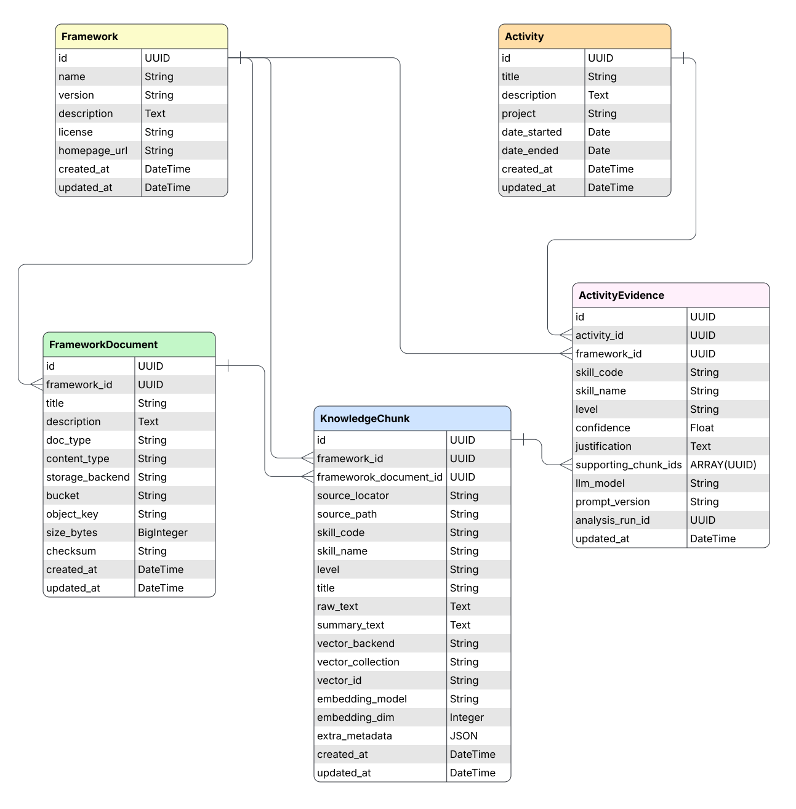

# SkillBucket Architecture

#### This docuument contains information about the design of SkillBucket.

## Contents
[Database Structure](#Database-Structure)
- [entity relationship diagram](#entity-relationship-diagram)
- [entities and attributes](#entities-and-attributes-tables-and-fields)

## Database Structure

> ⚠️ Everything in this section is a prototype intended for the proof of concept stage and is subject to change during development.

### Entity Relationship Diagram
The core database structure is a set of PostgreSQL tables as shown in the entity relationship diagram below. This is interacted with using a Python ORM ([SQLAlchemy](https://www.sqlalchemy.org)).

    

 

### Entities and Attributes (Tables and Fields)

#### Entity: Activity
An `Activitiy` is something a user has done which can be used as evidence towards aspects of a CPD/competency framework.

Attribute      | Type     | Description                               | Nullable
:---:          | :---:    | :---:                                     | :---:
id             | UUID     | Primary key                               | no
title          | String   | Title of activity                         | no
description    | Text     | Details of the activity                   | no
project        | String   | Project the activity contributed towards  | yes
date_started   | Date     | Date when the activity started            | yes
activity_ended | Date     | Date when the activity ended              | yes
created_at     | DateTime | Datetime the entity was created           | no
updated_at     | DateTime | Datetime the entity was last updated      | no

 

#### Entity: Framework
A `Framework` is a CPD/competency framework (e.g SFIA)

Attribute      | Type     | Description                               | Nullable
:---:          | :---:    | :---:                                     | :---:
id             | UUID     | Primary key                               | no
name           | String   | Framework name                            | no
version        | String   | Framework version                         | yes
description    | Text     | Description of the framework.             | no
license        | String   | Framework license                         | yes
homepage_url   | String   | URL of framework homepagevv               | yes
created_at     | DateTime | Datetime the entity was created           | no
updated_at     | DateTime | Datetime the entity was last updated      | no

 

#### Entity: FrameworkDocument
A `FrameworkDocument` is a text document containing documentation or other content relevant to understanding and using a given `Framework`.

Attribute       | Type       | Description                                 | Nullable
:---:           | :---:      | :---:                                       | :---:
id              | UUID       | Primary key                                 | no
framework_id    | UUID       | Foreign key for `Framework`                 | no
title           | String     | Document title                              | yes
description     | Text       | Description of the document                 | yes
doc_type        | String     | Document type (e.g pdf, docx)               | no
content_type    | String     | Document content type (e.g application/pdf) | yes
storage_backend | String     | Storage solution used for this document     | no
bucket          | String     | Storage bucket name                         | no
object_key      | String     | Key of document object in bucket            | no
size_bytes      | BigInteger | Document size in bytes                      | yes
checksum        | String     | Document checksum                           | yes
created_at      | DateTime   | Datetime the entity was created             | no
updated_at      | DateTime   | Datetime the entity was last updated        | no

 

#### Entity: KnowledgeChunk
A `KnowledgeChunk` is an extract from a `FrameworkDocument` (the actual pdf or other document) which has been 'chunked' using some form of chunking strategy. It contains both raw text and optionally a summary whhich can be used by an LLM, embedding model, or other component. 
  
Attribute             | Type       | Description                                      | Nullable
:---:                 | :---:      | :---:                                            | :---:
id                    | UUID       | Primary key                                      | no
framework_id          | UUID       | Foreign key for `Framework`                      | no
framework_document_id | String     | Foreign key for `FrameworkDocument`              | no
source_locator        | String     | Location in document (e.g p12, section 1.3)      | yes
source_path           | String     | Path of chunk (e.g Data > Modelling > Level 4)   | yes
skill_code            | String     | Skill/competency code (e.g PROG in SFIA)         | yes
skill_name            | String     | Skill/competency name                            | yes
level                 | String     | Competency level (e.g Level 4, L2)               | yes
title                 | String     | Title of the chunk                               | yes
raw_text              | Text       | Raw text portion from document                   | no
summary_text          | Text       | Summary of `raw_text`                            | yes
vector_backend        | String     | Name of vector store solution (e.g qdrant)       | no
vector_collection     | String     | Collection name within vector store (e.g sfia_8) | no
vector_id             | String     | Chunk ID in vector store                         | no
embedding_model       | String     | Name of embedding model used                     | yes
embedding_dim         | Integer    | Dimensionality of embedding space                | yes
extra_metadata        | JSON       | Other metadata                                   | yes
created_at            | DateTime   | Datetime the entity was created                  | no
updated_at            | DateTime   | Datetime the entity was last updated             | no

 

#### Entity: ActivityEvidence
A `ActivitiyEvidence` is an `Activity` which evidences a certain skill for a specific `Framework`.

Attribute            | Type        | Description                                                                    | Nullable
:---:                | :---:       | :---:                                                                          | :---:
id                   | UUID        | Primary key                                                                    | no
activity_id          | UUID        | Foreign key for `Activity`                                                     | no
framework_id         | UUID        | Foreign key for `Framework`                                                    | no
skill_code           | String      | Skill/competency code (e.g PROG in SFIA)                                       | yes
skill_name           | String      | Skill/competency name being evidenced                                          | no
level                | String      | Competency level (e.g Level 4, L2)                                             | yes
confidence           | Float       | Confidence of analysis/justification                                           | yes
justification        | Text        | LLM justification                                                              | no
supporting_chunk_ids | ARRAY(UUID) | Array of `KnowledgeChunks` used in analysis referenced by `knowledge_chunk.id` | yes
llm_model            | String      | LLM model name used for analysis                                               | no
prompt_version       | String      | Version of prompt used for analysis                                            | yes
analysis_run_id      | UUID        | Analysis run which produced this piece of evidence.                            | yes
created_at           | DateTime    | datetime the entity was created                                                | no
